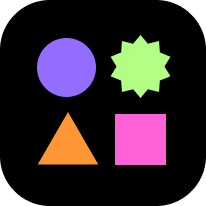

<div align="center">
  <br />
  
  <h1>re:Fashion</h1>
  <a href="https://hits.seeyoufarm.com"></a>
  
  
</div>

##  프로젝트 소개
**re:Fashion**은 `fashion`을 `recycle`한다는 의미를 지닌 이름입니다.

**re:Fashion**은 **AI 기반 패션 리세일 마켓**으로 **AI 기반 추천 알고리즘**을 통해 상하의 코디를 매칭하고 상품 판매 시 **AI 이미지 인식을 통해 의류를 분석**하여 의류 정보를 제공해주는 패션 리세일 마켓입니다.

**re:Fashion**은 모바일, 데스크탑 모두 대응하기 위해 반응형 디자인을 적용한 웹서비스입니다.

### 배포 주소
> production: https://refashion.link<br/>development: https://dev.front.refashion.link

### 화면 및 기능
|  |    |    |    |  |  
| :-----------------------------------------------------------------------------------------------------------------: | :-----------------------------------------------------------------------------------------------------------------: | :-----------------------------------------------------------------------------------------------------------------: | :-----------------------------------------------------------------------------------------------------------------: |:-----------------------------------------------------------------------------------------------------------------: |
|                                                      메인 페이지(오늘 추천하는 아이템)                                                       |                                                     상하의 코디 추천 페이지                                                      |                                                     shop 페이지                                                      |                                                     shop 필터 기능                                                      |                                                      pull to refresh 기능                                                      |

|  |  |    |    |    |  |  
| :-----------------------------------------------------------------------------------------------------------------: | :-----------------------------------------------------------------------------------------------------------------: | :-----------------------------------------------------------------------------------------------------------------: | :-----------------------------------------------------------------------------------------------------------------: |:-----------------------------------------------------------------------------------------------------------------: |:-----------------------------------------------------------------------------------------------------------------: |
|                                                       상품 디테일 페이지                                                        |                                                      상품 디테일 페이지 - 어울리는 의류 추천                                                       |                                                     이미지 업로드 후 인식 결과                                                      |                                                     상품 등록 1                                                      |                                                     상품 등록 2                                                      |                                                      상품 등록 - 임시저장 기능                                                      |

|  |  |   |    |  |
| :-----------------------------------------------------------------------------------------------------------------: | :-----------------------------------------------------------------------------------------------------------------: | :-----------------------------------------------------------------------------------------------------------------: | :-----------------------------------------------------------------------------------------------------------------: |:-----------------------------------------------------------------------------------------------------------------: |
|                                                       상품 검색 페이지                                                        |                                                      로그인                                                       |                                                     마이 페이지                                                      |                                                     설정 페이지                                                      |                                                       개인맞춤 정보 입력                                                        |


##  기술 스택

### Atomic Design Pattern 을 통한 컴포넌트 관리
``` md
📁 components
├── 📁 shared
│   ├── 📁 atoms
│   ├── 📁 molecules
│   ├── 📁 organisms
│   └── 📁 templates
├── 📁 shop
│   ├── 📁 atoms
│   ├── 📁 molecules
│   ├── 📁 organisms
│   └── 📁 templates
├── 📁 upload
│   ├── 📁 atoms
│   ├── 📁 molecules
│   ├── 📁 organisms
│   └── 📁 templates
...

📁 pages
├── 📁 shop
├── 📁 upload
...
```

### Front-end


0. [yarn berry & Zero-Install](https://toss.tech/article/node-modules-and-yarn-berry)를 사용하여 의존성 용량을 줄이고 CI 단계에서 의존성 설치 시간을 없앴습니다.

1. `Next.js`의 `SSG`, `SSR`을 활용해 자주 바뀌지 않는 데이터에 대한 불필요한 API 요청을 줄이고 UX를 개선하고자 했습니다. 뿐만 아니라 `SEO`을 향상시킬 수 있었습니다.

2. `React.js`을 사용하여 `SPA`를 구성하고 `UI`를 구현하였습니다. `상품 업로드`, `상품 필터`, `개인맞춤 정보 관리` 페이지와 같이 사용자와 인터랙션이 많은 부분에서 불필요한 렌더링을 줄였습니다.

3. `TypeScript`을 사용하여 개발 단계에서 타입의 안정성을 높여 런타임에서 일어날 버그를 사전에 줄였습니다. 타입 추론이 가능한 코드를 작성하며 개발자의 경험(`DX`)을 중요시했습니다.

4. `React-Query`를 사용하여 선언적인 `Data Fetching` 로직을 작성하였고 서버로부터 받은 데이터를 캐싱하여 전역 상태로 사용했습니다.

5. `zustand`를 사용하여 과도한 `props drilling`을 방지하며 클라이언트에서 필요한 상태를 관리했습니다. `상품 업로드 임시저장`기능 구현을 위해 `persist` 기능을 사용했습니다.

6. `sass`를 사용하여 스타일을 관리했습니다.

7. `Jest`를 사용하여 모듈에 대한 단위 테스트를 진행했습니다.

8. `Storybook`을 사용하여 `UI` 테스트를 진행했으며 `Atomic Desgin Pattern`과 함께 `CDD`를 진행했습니다.

### DevOps


1. `Github Actions`를 사용하여 지속적으로 통합(테스트, 린트, 타입 검사, lighthouse)했으며 `AWS EC2`에 지속적으로 배포했습니다.

2. `nginx`를 사용하여 웹서버를 구성했습니다.(포트 포워딩, SSL 인증)

3. `AWS EC2`를 통해 `Next.js`서버 역할을 수행하며 `Front-end` 번들 파일을 서빙했습니다.

##  re-pashion 팀 소개
|                                                                                                                       김동용 : FE, 팀장                                                                                                                       |                                                                                                                       김서기 : AI                                                                                                                       |                                                                                                                       이동우 : BE                                                                                                                       |
| :-----------------------------------------------------------------------------------------------------------------------------------------------------------------------------------------------------------------------------------------------------: | :-----------------------------------------------------------------------------------------------------------------------------------------------------------------------------------------------------------------------------------------------------: | :-----------------------------------------------------------------------------------------------------------------------------------------------------------------------------------------------------------------------------------------------------: |
|                                                                                                                                                                           |                                                                                                                        |                                                                                                                                                                           |
|                                                                                                         [@kingyong9169](https://github.com/kingyong9169)                                                                                                          |                                                                                                    [@seogi98](https://github.com/seogi98)                                                                                                     |                                                                                                        [@DongWooE](https://github.com/haryung-lee)                                                                                                        |

##  실행 방법

### Env variables setting
``` bash
# server
AI_API_URL=your_ai_server_url
API_URL=your_server_url

# client
CLIENT_URL=your_client_url

# monitoring and analytics
SENTRY_DSN=your_sentry_dsn
GA_ID=your_ga_id

# oauth
OAUTH_LOGOUT_URL=oauth_logout_url
LOGOUT_CLIENT_ID=cognito_logout_client_id
OAUTH_URL=oauth_url
OAUTH_CLIENT_ID=cognito_oauth_client_id
OAUTH_STATE=cognito_oauth_state
OAUTH_SCOPE=cognito_oauth_scope
OAUTH_REDIRECT_URI=oauth_redirect_url
LOGOUT_REDIRECT_URI=oauth_logout_redirect_url
```

### Installation
```bash
# press command + shift + p
# click TypeScript: Select TypeScript Version...
# click Use Workspace Version
# download zip-fs vscode extension

npm install -g yarn
yarn --version
```

### Development mode
``` bash
yarn dev
```

### Production mode
``` bash
yarn build
yarn start
```

### Test
``` bash
yarn test
```

<p align="center">
  
</p>

<br/>

<p align="center"><i>This Project is Sponsored by <b>Software Maestro</b></i></p>

<p align="center">This work was supported by the Institute of Information & Communications Technology Planning & Evaluation(IITP) grant funded by the Ministry of Science and ICT(MSIT) (IITP-2022-SW Maestro training course).</p>
